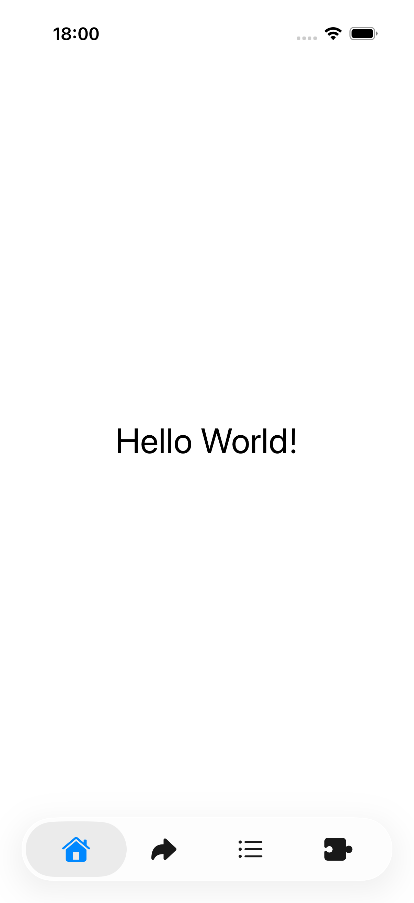
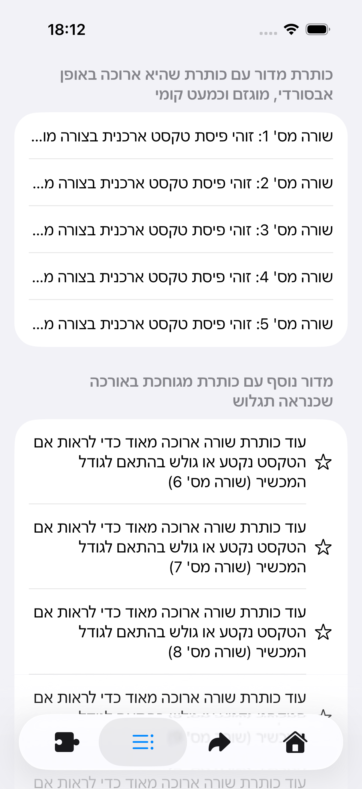

# VLM-based Agentic UI Testing

This project uses **Google Gemini 3 Flash (Vision Language Model)** to act as a testing agent. Within this Proof of Concept implementation, Gemini is instructed to detect any truncated text within the UI and logs all truncations found during its agentic traversal.

This project has been bundled with an example UI that has a navigation view with some views having truncated text whilst others do not to showcase the agent's ability to traverse through views and stop when a truncated view has been found.
>Note: Translations are likely to be inaccurate as they are machine-translated for the purposes of this demo.




## Advantages to 'Vision-less' Approaches

Standard XCUITest is "blind". It can read the internal data of a label, but it cannot see how it renders on screen. 

## Key Features

### Multi Language Support

Within this Proof-of-Concept, the application has been translated to English, Arabic, French, German, Hebrew and Spanish. This is to demonstrate that VLMs are multi-lingual and can detect truncation errors regardless of language.

### Visual Layout Verification

The agent does not rely on the view hierarchy but instead uses a screenshot to detect issues. Currently tested uses include:

* **Truncated Text:** Words cut off mid-sentence or ending in "...".
* **Overlapping Elements:** Text bleeding into buttons.
* **Render Issues:** Frosted glass effects making text unreadable.

### Reduced Flakiness

Traditional tests often fail because a selector (`app.buttons["submit_v2"]`) changed. This agent uses vision instead.

* *'Vision-less':* Find element by ID `submit_btn`. (Fails if ID changes).
* *VLM-based:* "Find the big blue button that looks like it submits the form." (Works even if the ID is missing).

## How It Works

The core loop runs inside a standard `XCTestCase`:

1. **Snapshot:** Captures a screenshot + accessibility tree.
2. **Analyse:** Sends data to Gemini 3 Flash with the specific goal: *"Find any truncated text on this screen."*
3. **Report (Log):**
    * If truncation is found: **Logs a Visual Warning** with coordinates.
    * If clean: **Navigates** to the next unexplored screen to continue searching.


## Project Structure

* **`AgentRunnerTests.swift`**: Main agent loop. Handles the navigation and logging of visual bugs.
* **`GeminiClient.swift`**: Handles sending and receiving responses from the Gemini API
* **`ElementTree.swift`**: Handles the accessibility tree given to the VLM.

## Quick Start

### Prerequisites

* Xcode 26
* A Gemini API Key
    * Can be sourced at [Google AI Studio](https://aistudio.google.com/app/api-keys)

### Setup

1. **Clone the repo:**
```bash
git clone https://github.com/17jlee/VLM_UI_testing.git

```


2. **Set API Key:**
Open `Secrets.xconfig` and append your key to `API_KEY = ` with your key.
3. **Run:**
Press `Cmd + U` to start testing.

> Note: You may run into token usage rate issues if running tests for all languages in parallel. The project has been configured to run sequentially. Since Google heavily limits the usage rate on free keys, you may have to pause between language runs or upgrade to a basic paid key.

## Sample Report

This project uses native **Xcode Attachments** to generate rich visual reports.

## Sample Results

```
DECISION: done -> 
REASONING: Visual inspection of the screenshot clearly shows ellipses at the end of the Hebrew sentences in the first list, indicating that the full text provided in the UI hierarchy labels is not being displayed.
--------------------------------------------------
VISUAL CHECK: ⚠️ TRUNCATION DETECTED
LOCATION: The text entries labeled 'שורה מס' 1' through 'שורה מס' 5' in the first white container are truncated with ellipses (...) on the left side of the text (standard for RTL truncation).
--------------------------------------------------
HIERARCHY SNIPPET:
    StaticText, , {{16.0, 62.0}, {370.0, 62.3}}, label: 'כותרת מדור עם כותרת שהיא ארוכה באופן אבסורדי, מוגזם וכמעט קומי'
    StaticText, , {{16.0, 124.3}, {370.0, 52.0}}, label: 'שורה מס' 1: זוהי פיסת טקסט ארכנית בצורה מוגזמת וארוכה באופן לא סביר המשמשת ככותרת שורת רשימה'
    StaticText, , {{16.0, 176.3}, {370.0, 52.0}}, label: 'שורה מס' 2: זוהי פיסת טקסט ארכנית בצורה מוגזמת וארוכה באופן לא סביר המשמשת ככות... (truncated)'

```


---

*Built with [Swift](https://developer.apple.com/swift/) and [Google Gemini](https://deepmind.google/technologies/gemini/).*
